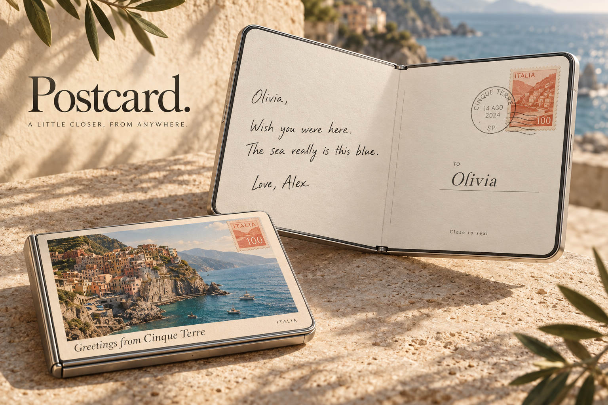

# Postcard

**A little closer. From anywhere.**

Turn a travel photo and a personal note into a digital postcard on a foldable phone. The closed phone shows the photographic front; opening reveals the message; closing seals the draft. Sending is an explicit action.

## Experience

1. Choose a travel photo and personalize the recipient, sender, destination, and message.
2. Open the postcard to read or write its back.
3. Close it to seal, with a restrained animation and supported haptic.
4. Share the postcard. The planned recipient experience is an HTTPS link that Grandma can open without an account and tap to flip.

## Visual direction and saved renders

Cream paper, dark green ink, vermilion stamps, elegant serif typography, and travel photography. Cinque Terre is the demo destination.

- [Photographic front](../design/01-front.png)
- [Message back](../design/02-back.png)
- [Sealed postcard](../design/03-seal.png)
- [Browser preview](../demos/postcard/index.html)
- [Interactive demo](../demos/postcard/postcard-demo.html)

The renders are design references. The browser demo can be downloaded and opened locally.

## Implementation and next work

The SwiftUI prototype, photo assets, app icon, and project configuration are in this directory. Image sharing, HTML export, and supported-device Messages composition exist in the source. Hosted recipient links, backend publishing, printed-card ordering, and payment are not implemented. See [setup and verification notes](README.md) and [the detailed team prompts and proposed API](TEAM_PROMPTS.md).

## Four team branches

| Owner | Branch | Responsibility |
|---|---|---|
| Barrat (you) | `design/postcard-polish` | Visual direction, assets, and demo |
| Pranav | `feature/postcard-delivery` | Backend and recipient web experience |
| Z | `feature/native-postcard-editor` | Native editor and publishing integration |
| Zabir | `feature/duo-interaction` | Fold interactions and simulator |

Each branch contains the complete shared Postcard starting point, so each person can work independently. The detailed prompts define file ownership and integration boundaries.
