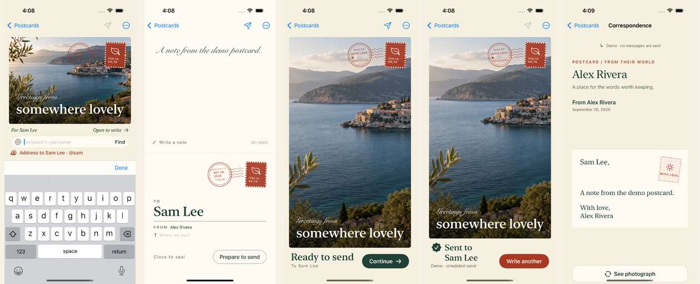
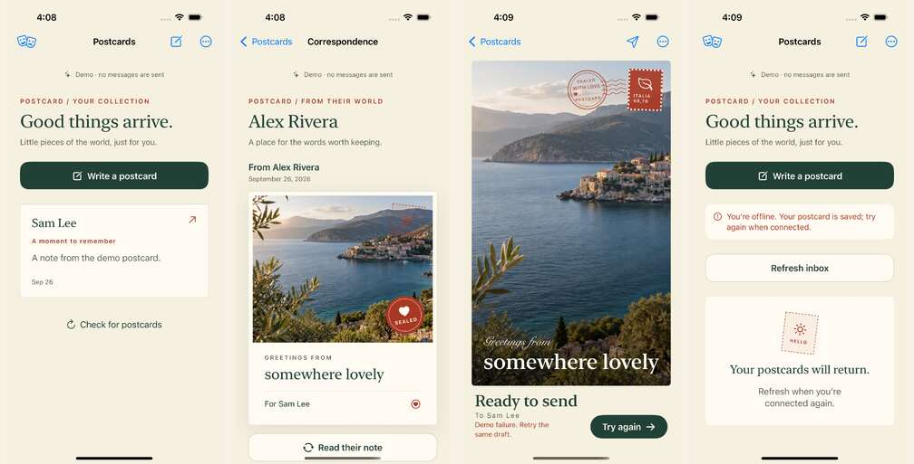

# Postcard

A photo and a handwritten-feeling note, sent to one person, as a postcard.

Pick someone by their exact username, put a photo on the front, and write on the back. **The compose screen is the postcard:** closed, it shows the front; open, the back spreads across the fold with your note on one side and the address on the other; closed again, it is sealed and ready. On the iPhone Duo that gesture is literal: unfold the device to open the card, fold it to seal. Sending is always a separate, explicit tap (Continue), so folding can never send anything. The recipient finds the postcard in their inbox, sees the photo, and flips it over to read the note.



<sub>Front · open: note and address · sealed, ready to send · sent (demo) · the recipient reading it. Captured by the UI test suite from the integrated build (iPhone simulator, iOS 18.5, fixture mode).</sub>

## Why it is built this way

- **The fold is the interaction, not a gimmick.** A native iOS 27.1 hinge bridge (`onHingeChange`) feeds one presentation controller: front → writing → sealed → sending → sent. The same controller is driven by Open and Seal buttons on every other iPhone, so the app runs on iOS 17 or later and the Duo features only switch on where they exist.
- **Nothing sends by accident.** The presentation controller has no reference to the network service. Only the explicit Send action calls `send(draft:)`, and the tests assert that folding, opening, sealing, and animation completion never do.
- **"Sent" means stored.** A postcard shows as sent only after the backend has stored it. There is no fake "delivered" or "read". Each draft's id is its idempotency key, so retries after failures can never create a duplicate.
- **Private by default.** Supabase row-level security on every table, a private photo bucket with per-user paths, signed photo URLs that expire in 5 minutes, and exact-username lookup with no public directory and no contact scraping.

## Demo in 60 seconds (no credentials)

Without backend configuration the app runs in **fixture mode**: an in-memory service with two demo accounts, clearly labeled on every screen. Nothing leaves the device.

1. `cd ios && xcodegen generate && open Postcard.xcodeproj`, then run on the iPhone Duo simulator or any iPhone simulator (Xcode 27.1).
2. You are **Alex Rivera** with an empty inbox. Tap **Write a postcard**. The first draft is ready: a photo on the front, "Greetings from Cinque Terre", addressed to **Sam Lee**. To address it to someone else, type their exact username in the margin under the card and tap **Find**.
3. **Open to write** (or unfold the Duo). The back spreads across the fold: write a note on one side; the address, stamp, and postmark are on the other.
4. **Prepare to send** (or fold the Duo). The card is sealed: "Ready to send". Nothing has been sent.
5. **Continue**. Only this tap sends; the card shows "Sent to Sam Lee" (simulated in the demo).
6. Go back: the inbox now lists Sam Lee.
7. **Demo → View as Sam Lee**, open Alex Rivera's postcard, and tap **Read their note**.

The Demo menu also has **Fail the next send** (shows the error; Try again stores the postcard exactly once) and **Simulate offline** (the inbox shows a retryable offline state). Launch arguments `--compose` and `--open` jump straight to the composer or its open back, for demos and screenshots.



## Verification

Every row is an actual run from this integration. Fixture success is not presented as live-backend success.

| Suite | Where it ran | Result |
|---|---|---|
| Backend end-to-end (`tests/backend`): auth, RLS, storage, RPCs, idempotency and concurrency, realtime, and 9 hardening regressions (write-once photos, delete races, anonymous realtime) | Local Supabase (CLI 2.118.0) rebuilt from scratch with all migrations | **27/27 pass** |
| `PostcardServices`: fixture, recorded wire contract, and **live** tests of the real Swift Supabase adapter against the hardened local backend | Linux, Swift 6.4 | **11/11 pass** (realtime needs a libcurl with WebSockets; it skips with a reason on stock Ubuntu libcurl) |
| `PostcardCore` | Linux, Swift 6.4, and Xcode 27.1 | **1/1 pass** |
| `PostcardUI` package tests (form rules) | Xcode 27.1 simulator, and Linux against the real Core models | **6/6 pass** |
| App build: all four packages plus the app, Swift 6 strict concurrency, iOS 17.0 target | Xcode 27.1 | **Succeeds** |
| `PostcardAppTests`: presentation controller (hinge debounce, seal once, suppression), compose (folding never sends, one send per submission, retry keeps the draft id), platform, integration regressions | iPhone 16 Pro simulator, iOS 18.5 (below the Duo gate) | **25/25 pass** on the final tree |
| `PostcardUITests`: compose → open → write → seal → Continue → the recipient reads it; failed send → Try again stores exactly one postcard; offline → retry → recovery | iPhone 16 Pro simulator, iOS 18.5 | **3/3 pass** on the final tree |
| Same two suites on the iPhone Duo | iPhone Duo simulator, iOS 27.1 | **25/25 and 3/3 passed** on the integration branch's first port of the redesign (`e1563fa`). The rerun on the final tree was interrupted when the build Mac went to sleep; rerun before a Duo demo. |
| App in live mode against a backend, two accounts | — | **Not run.** The adapter is verified live on Linux; the app UI in live mode is not. |
| Physical fold on hardware or Bitrig's 3D simulator | — | **Not run.** The hinge path is covered by controller tests. |
| Hosted Supabase | — | **Not deployed** (needs separate authorization) |

## Run it

Requirements: Xcode 27.1 (iOS 27.1 SDK; Xcode 27.0 cannot compile the Duo APIs), XcodeGen 2.44+, and for the backend Docker, the Supabase CLI 2.118+, and Node 20+.

**iOS app and tests**

```sh
cd ios && xcodegen generate
xcodebuild -project Postcard.xcodeproj -scheme Postcard \
  -destination 'platform=iOS Simulator,name=iPhone Duo' CODE_SIGNING_ALLOWED=NO test
```

If Xcode 27.1 is not the selected Xcode, prefix commands with `DEVELOPER_DIR=/path/to/Xcode.app/Contents/Developer`.

**Local backend and its tests**

```sh
supabase start -x imgproxy,mailpit,postgres-meta,studio,edge-runtime,logflare,vector,supavisor
supabase db reset                          # all migrations + local users alice/bob/eve (password postcard-local-1)
supabase status -o env                     # API URL and publishable key
cd tests/backend && npm install && SUPABASE_PUBLISHABLE_KEY=<publishable key> npm test
```

If Docker Hub rate-limits image pulls, the default `public.ecr.aws` registry or `SUPABASE_INTERNAL_IMAGE_REGISTRY=ghcr.io` works.

**Swift packages, including the live adapter test** (local hosts only; it creates throwaway users)

```sh
(cd packages/PostcardCore && swift test)
cd packages/PostcardServices
POSTCARD_LIVE_SUPABASE_URL=http://127.0.0.1:54321 \
POSTCARD_LIVE_SUPABASE_PUBLISHABLE_KEY=<publishable key> swift test
python3 ../PostcardUI/Examples/test_rules.py
```

**App against the local backend**

```sh
cp ios/Config/Local.xcconfig.example ios/Config/Local.xcconfig     # gitignored
# SUPABASE_URL = http:/$()/127.0.0.1:54321
# SUPABASE_PUBLISHABLE_KEY = <publishable key>
cd ios && xcodegen generate
```

Then sign in as `alice@postcard.test` or `bob@postcard.test` (password `postcard-local-1`). Launch with `-forceDemo` to stay in fixture mode anyway.

## Configuration

| Name | Where | Notes |
|---|---|---|
| `SUPABASE_URL`, `SUPABASE_PUBLISHABLE_KEY` | `ios/Config/Local.xcconfig` (gitignored) | Empty means fixture mode. The app only ever receives the publishable key. |
| `SUPABASE_SECRET_KEY` | `backend/.env` (gitignored) | Server jobs only (`backend/scripts/cleanup-orphans.mjs`). Never in the app. |
| `POSTCARD_LIVE_SUPABASE_URL`, `POSTCARD_LIVE_SUPABASE_PUBLISHABLE_KEY` | environment | Opt-in live Swift tests, refused for non-local hosts |
| `-forceDemo`, `-resetDemo` | app launch arguments | Force fixture mode; clear the stored draft. The UI tests pass both. |

No credentials are committed. `ios/Config/Postcard.xcconfig` ships with empty values.

## Architecture

```
packages/  (Swift Package Manager, Swift 6, iOS 17+)
  PostcardCore       models, presentation state, errors                         no dependencies
  PostcardMotion     PostcardFlipContainer, PostcardSealEffect (Reduce Motion)  no dependencies
  PostcardServices   PostcardService protocol,                                   → Core, supabase-swift 2.55.2
                     SupabasePostcardService, FixturePostcardService
  PostcardUI         Inbox, Conversation, Auth screens, visual system            → Core, Motion
                     (its PostcardComposerView is superseded in the app by PostcardExperienceView)

ios/  (app, iOS 17.0 target, Duo APIs gated on iOS 27.1)
  App/        AppEnvironment (fixture | Supabase, demo controls) → RootView → Inbox → Compose | Conversation
              Compose = PostcardExperienceView: front · back spread across the fold (ArrangementView) · sealed
  Features/   PostcardPresentationController   front → writing → sealed → sending → sent, never sends
              ComposeViewModel                 draft persistence, lookup, photo import, the only send path
              InboxViewModel, ConversationViewModel, SessionCoordinator
  Platform/   HingePosture (onHingeChange) · FileDraftStore · PhotoImporter (JPEG, ≤ 10 MB, ≤ 20 MP) · Haptics

supabase/  (live mode)
  Auth       email/password; profile created from signup metadata
  Postgres   profiles · conversations · conversation_members · postcards (immutable), all under RLS
  RPC        lookup_recipient · list_conversations · list_messages · send_postcard (atomic, idempotent)
  Storage    private postcard-photos/<uid>/<draft id>/photo.jpg; a sent photo can never be replaced or deleted
  Realtime   INSERT events on postcards → the app refetches; reconnects always refetch
```

## Security

- Every table uses row-level security. Clients can only read their own conversations, and they cannot insert, edit, or delete messages directly. All `SECURITY DEFINER` functions pin `search_path = ''` and are granted only to authenticated users.
- `send_postcard` derives the sender from `auth.uid()`, checks that the photo path belongs to the caller and the draft, validates lengths, and creates the conversation and message atomically. Concurrent retries with the same draft id return the original message; reusing an id with different content is rejected.
- Security reviews found that a signed upload URL issued before sending could replace a photo after it was sent. `supabase/migrations/20260926000500_hardening.sql` makes every photo write-once below the Storage API (a trigger freezes content and path for every role), keeps referenced photos from being deleted even by the service role or the orphan cleanup, locks the photo row inside `send_postcard`, publishes realtime inserts only, and stops anonymous realtime timing leaks. Each fix has a regression test.
- Remaining low-severity notes, with owners and next steps, are in [handoffs/integration.md](handoffs/integration.md#security-review).

## Repository map

| Path | What |
|---|---|
| `ios/` | The app (XcodeGen spec `ios/project.yml`); see [ios/README.md](ios/README.md) |
| `packages/` | The four Swift packages |
| `supabase/` | Migrations, local config, seed data |
| `backend/` | Backend design notes and error mapping ([backend/README.md](backend/README.md)), recorded wire fixtures, orphan-photo cleanup |
| `tests/backend/` | End-to-end backend suite |
| `design/` | Visual system ([SYSTEM.md](design/SYSTEM.md)), motion ([MOTION.md](design/MOTION.md)), assets, screenshots |
| `docs/` | Product brief ([PRODUCT.md](docs/PRODUCT.md)), shared contracts ([CONTRACTS.md](docs/CONTRACTS.md)), ownership ([OWNERSHIP.md](docs/OWNERSHIP.md)), agent role prompts |
| `handoffs/` | Each contributor's handoff, plus the [integration record](handoffs/integration.md) |

## Team

| Owner | Area | Delivered |
|---|---|---|
| Zafar | `supabase/`, `backend/`, `tests/backend/` | Schema, RLS and storage policies, RPCs, realtime, hardening from an adversarial review, end-to-end tests, wire fixtures |
| Pranav | `packages/PostcardCore`, `PostcardServices`, `PostcardMotion` | Shared models, Supabase adapter, fixture service, flip and seal motion |
| Barrat | `packages/PostcardUI`, `design/` | Screens, visual system, accessibility, motion choreography |
| Zubair | `ios/` | App shell, the postcard compose experience, Duo presentation controller, view models, draft persistence, photo import |

Integration merged the four workstreams, replaced the app's local stubs with the real packages, gated the Duo APIs, fixed the defects found in review, and hardened the backend. The details are in [handoffs/integration.md](handoffs/integration.md).

## Known limitations

- **Not yet verified:** the final tree's app tests on the iPhone Duo simulator (the run was interrupted), a physical fold on hardware or in Bitrig's 3D simulator, the app UI in live mode against a backend, and any hosted deployment.
- **Accessibility of the new compose screen:** it uses fixed-size display fonts (including a script face for the note), so it does not yet scale with Dynamic Type, and it has not had a full VoiceOver pass. The inbox, conversation, and sign-in screens use the audited `PostcardUI` components.
- **Out of scope for v1:** push notifications, read receipts, printing, payments, and public links. A conversation shows the newest 50 postcards, with no pagination UI.
- **Photos:** the server enforces bucket size and type and makes photos write-once, but it does not inspect image bytes. The client converts to JPEG and enforces 10 MB and 20 megapixels.
- **The fixture has two accounts** (Alex and Sam) and keeps messages in memory. Demo messages reset on relaunch; the draft persists.
